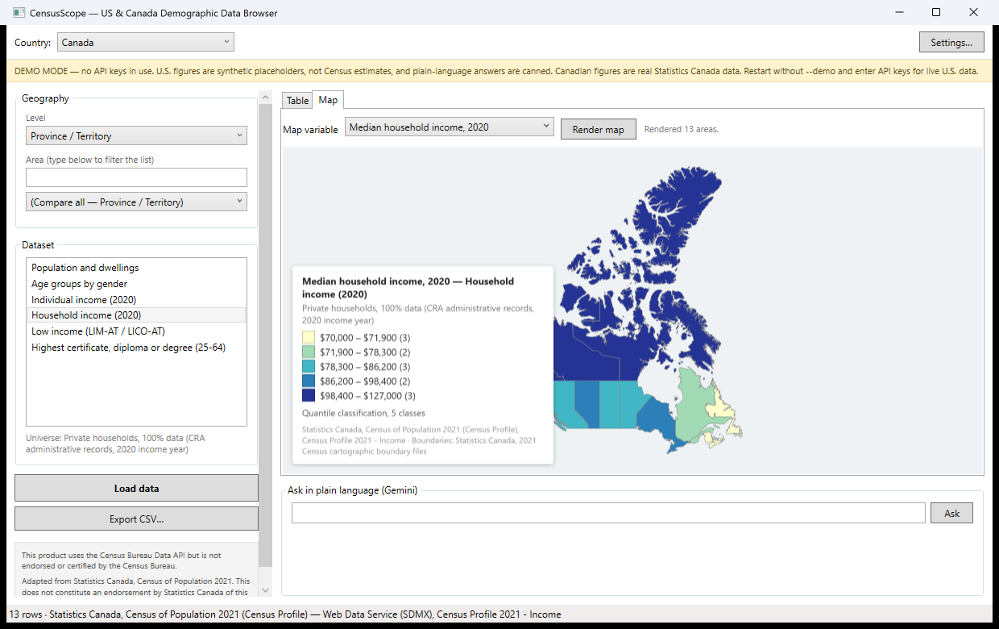
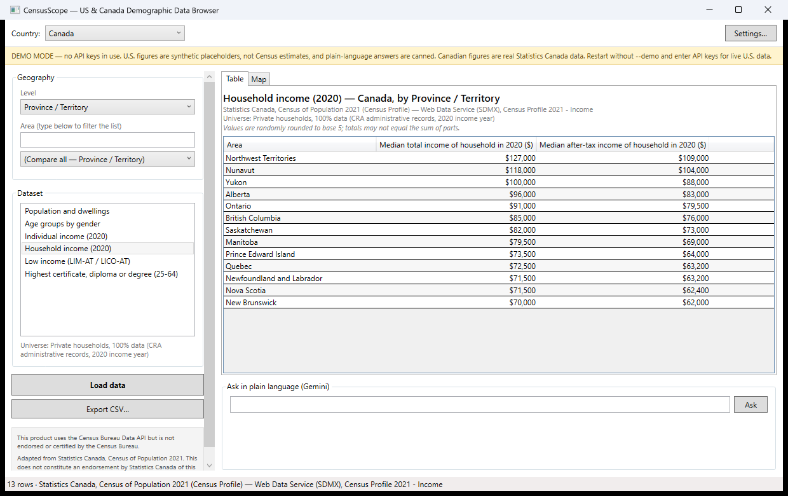

# US & Canada Demographic Data Browser

**[跳转到中文版 / Jump to Chinese version ↓](#中文版)**

A Windows desktop app for exploring official demographic statistics — population, age,
gender, income, and education — for **every state, county, and town in the United States**
and **every province, census division, and municipality in Canada**. Data comes live from
the two national statistical agencies, can be exported to CSV, drawn on an interactive
map, and queried in plain English through the Gemini API.

Built with C# / WPF on .NET 10. MIT licensed.

| Choropleth map (real Statistics Canada data) | Comparison table |
|---|---|
|  |  |

---

## What does it do?

Pick a country, a geographic level, an area, and a topic — the app fetches the official
numbers and shows them as a table, a ranked comparison, or a colored map:

- **Profile view** — one area, all categories. *"Show me everything about San Francisco
  County's educational attainment."*
- **Compare view** — every area at a level, ranked. *"Rank all Ontario census divisions
  by median household income."*
- **Map view** — a choropleth (colored map). *"Color every province by population density."*
- **CSV export** — save any result with raw values, margins of error, area codes, and a
  full source citation.
- **Plain-language queries** — type *"Which province has the highest median income?"* and
  the Gemini API translates it into a real query. The AI never invents numbers — it only
  picks which official query to run, and its interpretation is shown so you can verify it.

## Where does the data come from?

| | United States | Canada |
|---|---|---|
| Source | U.S. Census Bureau, **American Community Survey 2020–2024** (api.census.gov) | Statistics Canada, **2021 Census of Population** (Web Data Service, SDMX API) |
| Levels | State → County / Place (city, town, CDP) | Province/Territory → Census division → Census subdivision (municipality) |
| Area IDs | FIPS **GEOID** (`06` = California, `06075` = San Francisco County) | **DGUID** (`2021A000235` = Ontario, `2021A00053520005` = Toronto) |
| Map boundaries | Census cartographic boundary files (2024) | StatCan 2021 cartographic boundaries via their public REST service |

Every region has a unique official ID (GEOID / DGUID). The app uses these IDs — never
display names — to join statistics to map shapes and to tag every exported CSV row, so
your exports can be joined to other datasets reliably.

## Getting started

**Requirements:** Windows 10/11 and the [.NET 10 SDK](https://dotnet.microsoft.com/download).
(The map uses the WebView2 runtime, preinstalled on Windows 11; the app works fine
without it — you just lose the map tab.)

```bash
git clone https://github.com/WilliamGuo2002/US-Canada-Demographic-Data-Browser.git
cd US-Canada-Demographic-Data-Browser
dotnet run --project src/CensusScope.App
```

### Try it instantly — no API keys (demo mode)

```bash
dotnet run --project src/CensusScope.App -- --demo
```

In demo mode **Canadian data is live and real** (Statistics Canada needs no key), while
U.S. figures are clearly-labeled synthetic placeholders. A banner explains this at all
times so demo numbers can never be mistaken for real statistics.

### API keys for full functionality

Keys are entered under **Settings…** in the app (stored locally in
`%APPDATA%\CensusScope\settings.json`, never in this repository).

| Key | Needed for | How to get it |
|---|---|---|
| U.S. Census API key (free) | Live U.S. data | Request at [api.census.gov/data/key_signup.html](https://api.census.gov/data/key_signup.html) — any organization name and an email. **Click the activation link in the confirmation email**, or the key will be rejected. |
| Gemini API key | Plain-language queries only | [aistudio.google.com/apikey](https://aistudio.google.com/apikey). Note this key is **billed to the Google account that owns it**. |

The app shows a banner on first run pointing at exactly where the key goes.

## Reading the numbers correctly

Official statistics come with fine print, and the app surfaces it instead of hiding it:

- **Universe** — every dataset states its denominator population (e.g. U.S. education
  covers *population 25 years and over*; Canadian education covers *25–64 in private
  households*). Always shown above the results; read it before dividing anything.
- **U.S. margins of error** — every American Community Survey figure is a survey estimate
  with a 90% margin of error, shown as `±`. Small areas can have margins larger than the
  estimate itself.
- **Canadian random rounding** — Statistics Canada rounds all counts to multiples of 5,
  so categories rarely sum exactly to totals. This is normal, not a bug, and the app says
  so under every Canadian result.
- **The map refuses to mislead** — only rates, medians, densities, and percentages can be
  mapped (coloring raw counts mostly shows which areas are big). Derived percentages are
  suppressed for areas with tiny denominators, and the legend discloses the class method,
  per-class counts, and every suppression.

## For developers

```
src/CensusScope.Core       All logic, no UI dependency
  Providers/               IDemographicProvider + one implementation per country
  Catalogs/*.json          The dimension catalogs: datasets, variables, labels,
                           universes, map variables — configuration, not code
  Geo/                     Boundary download -> shapefile/GeoJSON -> cached WGS84 GeoJSON
  Services/                MapService (classification), GeminiService, CSV writer, ...
src/CensusScope.App        WPF shell (MVVM), MapLibre map page in WebView2
tools/                     Catalog generators — labels come verbatim from the agencies'
                           own metadata; rerun for a new data vintage
tests/                     117 offline tests (stubbed HTTP, real API response fixtures)
```

Design rules the code follows:

- **Geographic IDs are strings, always.** `06` must never become `6`.
- **Classifications are data, not code.** No shared enum forces U.S. and Canadian
  categories to align; each country ships its native classification in its catalog JSON.
  Adding a dataset is a config edit. Adding a country is one new provider class.
- **The AI never produces numbers.** Gemini maps natural language to a structured query
  (with the temperature at 0 and a strict response schema); data flows only from the
  official APIs.
- **Everything testable offline.** `ApiClient` accepts an injected handler, so both
  providers and the Gemini wire format are pinned by tests with zero network access:
  `dotnet test`.

## Data terms & attribution

- *This product uses the Census Bureau Data API but is not endorsed or certified by the
  Census Bureau.* U.S. boundary files are public domain (attribution required).
- Adapted from Statistics Canada, Census of Population 2021, under the
  [Statistics Canada Open Licence](https://www.statcan.gc.ca/en/reference/licence).
  This does not constitute an endorsement by Statistics Canada of this product.
- Maps are rendered by [MapLibre GL JS](https://github.com/maplibre/maplibre-gl-js)
  (BSD-3-Clause), bundled for fully offline use.
- The Census terms prohibit using the data to identify any individual person, household,
  or business. This app only retrieves published aggregate tables.

## License

[MIT](LICENSE) © 2026 Yixuan Guo

---

# 中文版

一个 Windows 桌面应用，用于浏览**美国每个州、县、市镇**和**加拿大每个省、普查区、市镇**的
官方人口统计数据——人口、年龄、性别、收入、教育。数据实时来自两国国家统计机构，可导出
CSV、绘制交互式地图，还能通过 Gemini API 用自然语言提问。

技术栈：C# / WPF / .NET 10。MIT 协议开源。

## 它能做什么？

选择国家、行政层级、地区和主题，应用会获取官方数据并以多种方式呈现：

- **档案视图** —— 一个地区的全部分类。*"旧金山县的教育程度全貌"*
- **对比视图** —— 某层级所有地区排名。*"安大略省所有普查区按家庭收入中位数排名"*
- **地图视图** —— 等值区域图（按数值着色）。*"按人口密度给每个省染色"*
- **CSV 导出** —— 任何结果一键保存，含原始数值、误差范围、地区代码和完整来源引用
- **自然语言查询** —— 输入*"哪个省收入中位数最高？"*，Gemini API 将其翻译为真实查询。
  **AI 从不编造数字**——它只负责选择执行哪条官方查询，且解读过程会显示出来供你核对

## 数据来源

| | 美国 | 加拿大 |
|---|---|---|
| 来源 | 美国人口普查局 **ACS 2020–2024**（api.census.gov） | 加拿大统计局 **2021 年人口普查**（Web Data Service，SDMX API） |
| 层级 | 州 → 县 / 市镇 | 省/地区 → 普查区 → 普查子区（市镇） |
| 地区 ID | FIPS **GEOID**（`06` = 加州，`06075` = 旧金山县） | **DGUID**（`2021A000235` = 安大略，`2021A00053520005` = 多伦多） |
| 地图边界 | 普查局制图边界文件（2024） | 加统计局 2021 制图边界（官方 REST 服务） |

每个地区都有唯一的官方 ID（GEOID / DGUID）。应用始终用 ID 而非地名来连接统计表和地图
图形，导出的 CSV 每行也带 ID——因此你的导出文件可以可靠地与其他数据集做关联。

## 快速开始

**环境要求：** Windows 10/11 和 [.NET 10 SDK](https://dotnet.microsoft.com/download)。
（地图依赖 WebView2 运行时，Windows 11 自带；没有它应用照常工作，只是没有地图页。）

```bash
git clone https://github.com/WilliamGuo2002/US-Canada-Demographic-Data-Browser.git
cd US-Canada-Demographic-Data-Browser
dotnet run --project src/CensusScope.App
```

### 零配置试用——无需任何 API key（演示模式）

```bash
dotnet run --project src/CensusScope.App -- --demo
```

演示模式下**加拿大数据是实时真实数据**（加统计局无需 key），美国数字为明确标注的合成
占位值。顶部常驻横幅说明这一点，演示数字不可能被误认为真实统计。

### 配置 API key 以启用全部功能

在应用的 **Settings…** 中填入（保存在本机 `%APPDATA%\CensusScope\settings.json`，
绝不进入本仓库）。

| Key | 用途 | 获取方式 |
|---|---|---|
| 美国 Census API key（免费） | 美国实时数据 | 在 [api.census.gov/data/key_signup.html](https://api.census.gov/data/key_signup.html) 申请——填任意组织名和邮箱即可。**务必点击确认邮件里的激活链接**，否则 key 无效。 |
| Gemini API key | 仅自然语言查询需要 | [aistudio.google.com/apikey](https://aistudio.google.com/apikey)。注意此 key **按其所属 Google 账号计费**。 |

首次运行时应用会显示横幅，指明 key 粘贴的位置。

## 正确解读数字

官方统计自带"小字条款"，本应用选择把它们摆在明面上而不是隐藏：

- **统计总体（Universe）** —— 每个数据集都标明分母人口（如美国教育数据覆盖 *25 岁及
  以上人口*，加拿大教育覆盖*私人家庭中 25–64 岁人口*）。结果上方始终显示；做除法前先读它。
- **美国误差范围** —— ACS 的每个数字都是抽样估计，带 90% 置信度的误差（显示为 `±`）。
  小地区的误差可能比估计值本身还大。
- **加拿大随机进位** —— 加统计局把所有计数进位到 5 的倍数，因此分类加总常与总数不符。
  这是正常现象而非 bug，每个加拿大结果下方都有说明。
- **地图拒绝误导** —— 只有比率、中位数、密度和百分比可以上图（给原始计数染色画出的
  主要是"哪个地区大"）。分母过小的派生百分比会被抑制，图例披露分级方法、每级地区数
  和所有抑制情况。

## 开发者指南

```
src/CensusScope.Core       全部业务逻辑，零 UI 依赖
  Providers/               IDemographicProvider 接口 + 每国一个实现
  Catalogs/*.json          维度目录：数据集、变量、标签、统计总体、地图变量
                           ——是配置而非代码
  Geo/                     边界下载 -> shapefile/GeoJSON -> 缓存为 WGS84 GeoJSON
  Services/                MapService（分级）、GeminiService、CSV 写入器等
src/CensusScope.App        WPF 界面（MVVM），WebView2 内嵌 MapLibre 地图页
tools/                     目录生成脚本——标签逐字来自统计机构官方元数据，
                           换数据年份时重新运行即可
tests/                     117 个离线测试（HTTP 桩 + 真实 API 响应夹具）
```

代码遵循的设计规则：

- **地区 ID 永远是字符串。** `06` 绝不能变成 `6`。
- **分类是数据不是代码。** 没有强迫美加口径对齐的共享枚举；每国在自己的目录 JSON 里
  携带原生分类。加数据集 = 改配置；加国家 = 写一个新 provider 类。
- **AI 从不产生数字。** Gemini 只把自然语言映射为结构化查询（temperature 0 + 严格
  响应 schema）；数据只从官方 API 流入。
- **一切可离线测试。** `ApiClient` 支持注入 HTTP handler，两国 provider 和 Gemini
  请求格式全部由零网络访问的测试钉死：`dotnet test`。

## 数据条款与署名

- *This product uses the Census Bureau Data API but is not endorsed or certified by the
  Census Bureau.* 美国边界文件为公共领域（须署名）。
- 改编自加拿大统计局 2021 年人口普查数据，依据
  [Statistics Canada Open Licence](https://www.statcan.gc.ca/en/reference/licence) 使用。
  这不构成加拿大统计局对本产品的背书。
- 地图由 [MapLibre GL JS](https://github.com/maplibre/maplibre-gl-js)（BSD-3-Clause）
  渲染，已打包为完全离线使用。
- 普查局条款禁止利用数据识别任何具体的个人、家庭或企业。本应用只获取已发布的聚合统计表。

## 许可

[MIT](LICENSE) © 2026 Yixuan Guo
